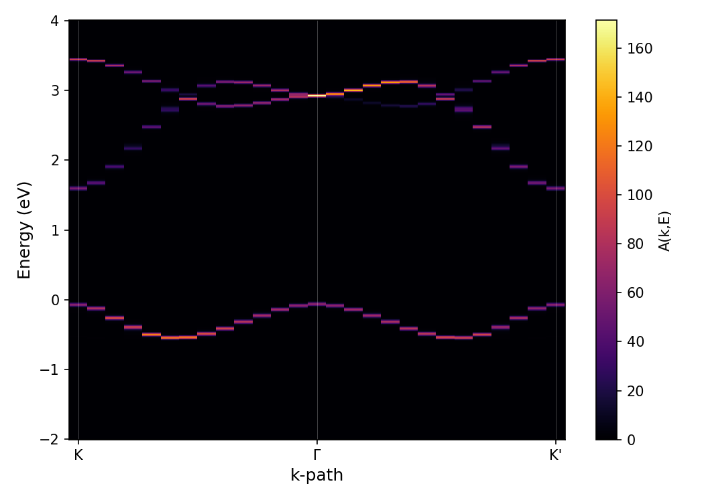

## The single-particle spectral function

KITE can compute the momentum-resolved single-particle spectral function, $A(\mathbf{k},E)$, the quantity of
relevance to angle-resolved photoemission spectroscopy (ARPES). Physically, $A(\mathbf{k},E)$ measures the
probability of finding an electron (or hole) with crystal momentum $\mathbf{k}$ at energy $E$, and is formally
the diagonal matrix element of the spectral operator in a Bloch-momentum basis,

$$
    A(\mathbf{k},E) = \langle \mathbf{k}|\, \delta(E-\hat{H}) \,|\mathbf{k}\rangle .
$$

For a non-interacting, disorder-free crystal this reduces to a sum of delta functions at the band
energies $E_n(\mathbf{k})$; disorder and finite lifetimes broaden these into finite-width peaks.

### How KITE computes it

$A(\mathbf{k},E)$ is obtained with the same Chebyshev/KPM machinery described in
[Background: Spectral Methods][spectral_background], except that the initial state fed into the
recursion is a normalized Bloch-like plane wave rather than a random vector (as for a full trace) or a
single real-space site (as for the LDOS):

$$
    |\mathbf{k}\rangle = \frac{1}{\sqrt{N}}\sum_{\mathbf{r},\alpha} w_\alpha\, e^{\,i\,\mathbf{k}\cdot(\mathbf{r}+\boldsymbol{\tau}_\alpha)}\,|\mathbf{r},\alpha\rangle,
$$

where $\mathbf{r}$ runs over unit cells, $\alpha$ runs over orbitals within the unit cell (at position
$\boldsymbol{\tau}_\alpha$), and $w_\alpha$ is a user-supplied per-orbital weight. This is why ARPES is
classified, alongside the LDOS, as a "diagonal matrix element" calculation in [Section 0][ground_rules]
rather than a full-trace one: `#!python num_random` plays no role, and the target function is evaluated at
one specific $\mathbf{k}$-point at a time.

## What each part of the workflow does

* **The Python interface** ([`#!python calculation.arpes()`][calculation-arpes]) specifies the $\mathbf{k}$-path,
  per-orbital weights $w_\alpha$, and the number of Chebyshev moments, and writes them into the HDF5 file.
* **KITEx** reads that file, builds the plane-wave state $|\mathbf{k}\rangle$ for each requested
  $\mathbf{k}$-point, and computes the Chebyshev moments of $A(\mathbf{k},E)$, writing them back into the
  same file.
* **KITE-tools** (`#!bash --ARPES`) reconstructs $A(\mathbf{k},E)$ from those moments over a chosen energy
  window and kernel, and optionally applies a simplified photoemission matrix-element weighting based on
  the incident light's wave vector and frequency (`#!bash -V`, `#!bash -O`) and on temperature/Fermi energy
  (`#!bash -T`, `#!bash -F`). Passing `#!bash -S` skips that weighting and outputs the bare spectral
  function instead — see the [post-processing documentation][kitetools] for the full flag reference.

## Defining the k-path

The `#!python k_vector` list is built with **Pybinding's** `#!python pb.results.make_path()`, using
Cartesian (physical-unit) k-space coordinates — the same units as `#!python lattice.reciprocal_vectors()`.
KITE converts these internally into fractional reciprocal-lattice coordinates for storage and internal use;
this conversion is automatic and should not be done by hand, and the k-points reported in KITE-tools'
output file are converted back to the same Cartesian units that were used as input.

A robust, orientation-independent way to obtain high-symmetry points is to read them directly off
`#!python lattice.brillouin_zone()`, which computes the actual Brillouin zone polygon for whatever lattice
vectors were used, rather than reusing a formula (e.g. `#!python K = (b1 - b2) / 3`) derived for a specific
lattice orientation:

``` python
bz = lattice.brillouin_zone()
Gamma = np.array([0, 0])
K  = bz[0]
M  = (bz[0] + bz[1]) / 2
```

For lattices whose electronic structure has only 3-fold (rather than full 6-fold) rotational symmetry —
such as monolayer TMDs, where the d-orbital hopping physics reduces the symmetry despite the underlying
triangular Bravais lattice being 6-fold symmetric — adjacent corners of the Brillouin zone correspond to
the two inequivalent valleys K and K′. A path intended to compare both valleys should include both, e.g.
`#!python bz[0]` and `#!python bz[1]`.

## The `weight` parameter

[`#!python weight`][calculation-arpes] assigns one value per **orbital** (not per named sublattice — for a
lattice with several single-orbital sublattices these coincide, but not in general), and can be complex.
Complex weights are useful for projecting onto specific orbital combinations — for example,
$d_{xy} \pm i\, d_{x^2-y^2}$ combinations correspond to states of definite orbital angular momentum. The
length of `#!python weight` must equal the total number of orbitals in the lattice.

## Worked example: monolayer MoS₂

The example below computes $A(\mathbf{k},E)$ along $K \to \Gamma \to K'$ for a monolayer MoS₂, using the
nearest-neighbor 3-band tight-binding model (three $d$-orbitals per metal site: $d_{z^2}$, $d_{xy}$,
$d_{x^2-y^2}$) of Liu *et al.*[^1] The full script is available
[here](https://github.com/tgrappoport/kite/blob/master/examples/arpes_tmd.py).

### Lattice

Each of the three $d$-orbitals is added as its own sublattice, all at the same position within the unit
cell, connected by explicit per-orbital-pair hoppings built from the tabulated tight-binding parameters:

``` python linenums="1"
import pybinding as pb
import numpy as np

# [a, z_XX, e1, e2, t0, t1, t2, t11, t12, t22, lambda_soc], Liu et al., Phys. Rev. B 88, 085433 (2013)
a, z_XX, e1, e2, t0, t1, t2, t11, t12, t22, lambda_soc = \
    [3.190, 3.130, 1.046, 2.104, -0.184, 0.401, 0.507, 0.218, 0.338, 0.057, 0.073]

lat = pb.Lattice(a1=[a, 0], a2=[a / 2, a * np.sqrt(3) / 2])

subs = ["Mo_0", "Mo_1", "Mo_2"]  # dz2, dxy, dx2-y2
lat.add_sublattices(
    (subs[0], [0, 0], e1),
    (subs[1], [0, 0], e2),
    (subs[2], [0, 0], e2),
)

# Nearest-neighbor hopping matrices (one per lattice direction) built from the
# tabulated parameters, then unpacked into individual scalar hoppings between
# the three sublattices -- see the full script for _hopping_matrices().
vector_1N = [[1, 0], [0, -1], [1, -1]]
for direction, matrix in zip(vector_1N, hopping_matrices):
    for i in range(3):
        for j in range(3):
            if abs(matrix[i][j]) > 1e-8:
                lat.add_hoppings((direction, subs[i], subs[j], matrix[i][j]))
```

### Settings and calculation

``` python
Gamma  = np.array([0, 0])
K      = np.array([4 * np.pi / (3 * a), 0])
Kprime = np.array([2 * np.pi / (3 * a), 2 * np.pi / (a * np.sqrt(3))])
k_path = pb.results.make_path(K, Gamma, Kprime, step=0.1)

configuration = kite.Configuration(
    divisions=[2, 2],
    length=[128, 128],
    boundaries=["periodic", "periodic"],
    is_complex=True,
    precision=1,
    spectrum_range=[-2, 4])

calculation = kite.Calculation(configuration)
calculation.arpes(k_vector=k_path, num_moments=512, weight=[1, 1, 1], num_disorder=1)
```

### Post-processing

``` bash
./build/KITE-tools arpes_tmd-output.h5 --ARPES -K jackson -S
```

This computes the bare spectral function (`#!bash -S`) with the Jackson kernel.

### Result

<div>
  <figure>
    
    <figcaption>Spectral function A(k,E) of monolayer MoS<sub>2</sub> along K→Γ→K', computed with the
    3-band model above (128×128 unit cells, 512 Chebyshev moments, Jackson kernel, bare spectral function).</figcaption>
  </figure>
</div>

The valence-band maximum sits at K (and, equivalently, K′), separated by a gap from the conduction bands,
consistent with MoS₂'s semiconducting character in this simplified nearest-neighbor model.

!!! example

    Get more familiar with KITE: reproduce this figure, then try adding a real photoemission matrix element
    (drop `#!bash -S` and supply `#!bash -V`/`#!bash -O`), or compare the two orbital-angular-momentum
    weightings `#!python weight=[0, 1, 1j]` and `#!python weight=[0, 1, -1j]` to see how the spectral weight
    contrasts between the K and K′ valleys.

[^1]: G.-B. Liu, W.-Y. Shan, Y. Yao, W. Yao, and D. Xiao, [Phys. Rev. B 88, 085433 (2013)](https://doi.org/10.1103/PhysRevB.88.085433); erratum [Phys. Rev. B 89, 039901 (2014)](https://doi.org/10.1103/PhysRevB.89.039901).

[spectral_background]: ../../background/spectral.md
[ground_rules]: ../optimization.md
[calculation-arpes]: ../../api/kite.md#calculation-arpes
[kitetools]: ../../api/kite-tools.md
